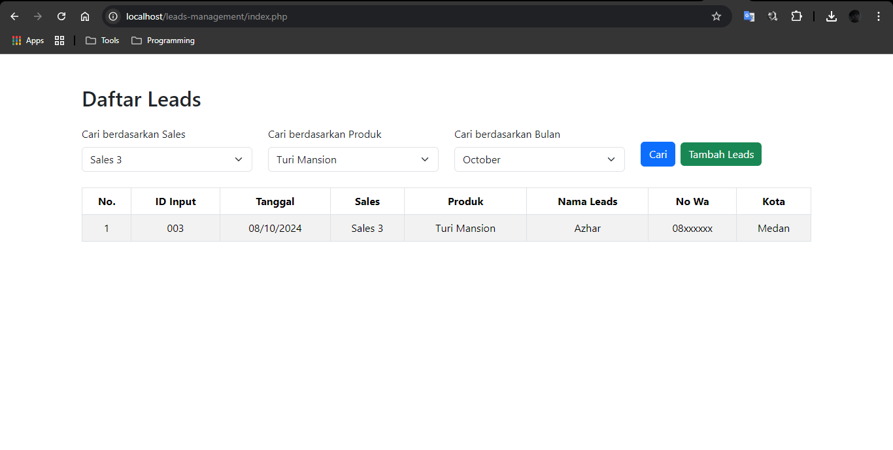
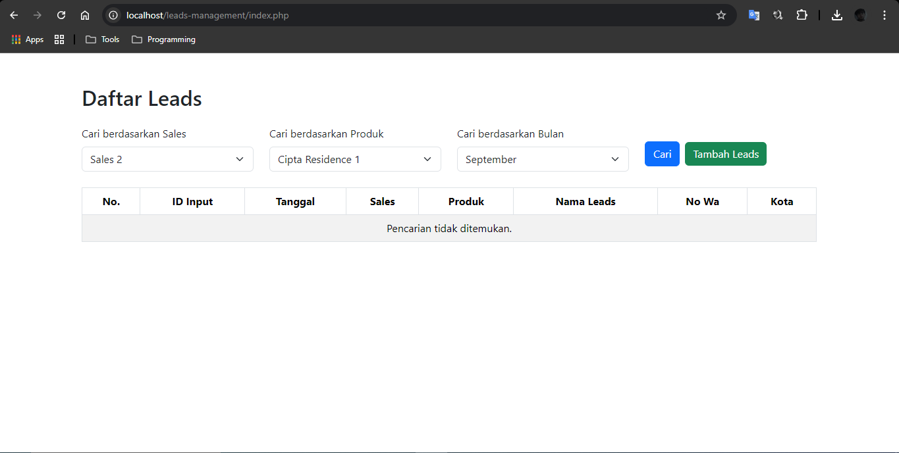
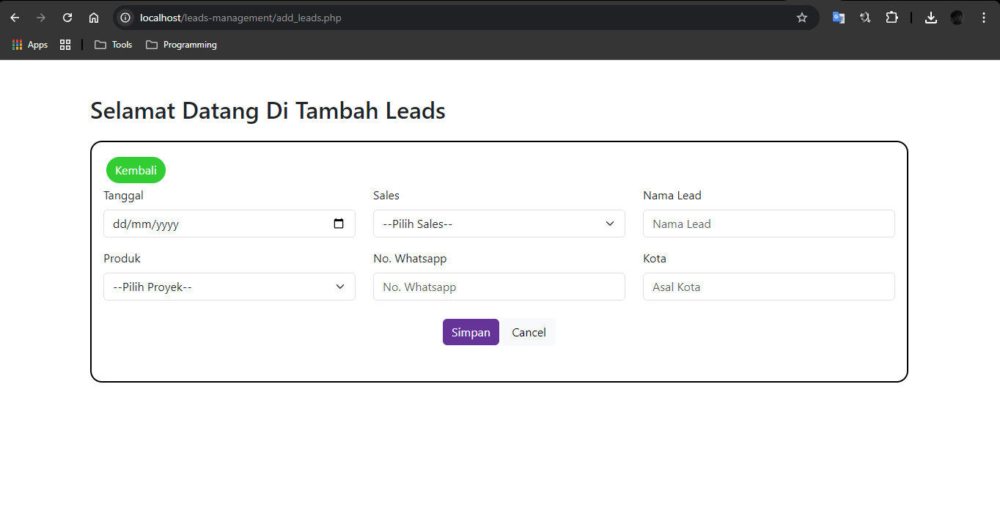
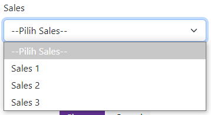
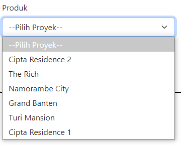
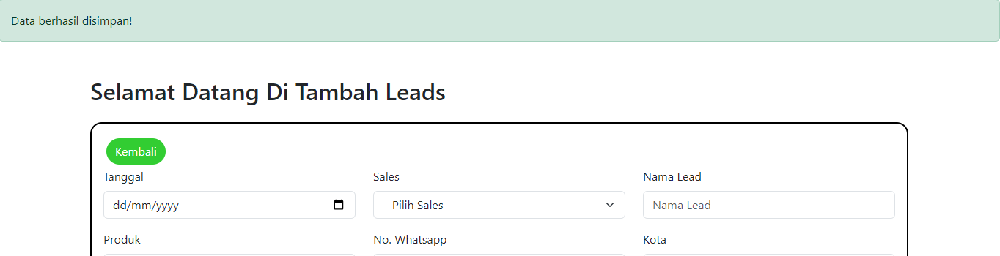

# Leads Management

#### Application using HTML, CSS (Bootstrap), dan PHP.
#### Database : MySql.

## Initial View

## Search Results When Data **Exists** in the Database

## Search Results When Data Does **Not Exist** in the Database

## 'Add Leads' Page

## Dropdown Options for 'Sales' and 'Product' Fields

## Notification After Submitting All Data
